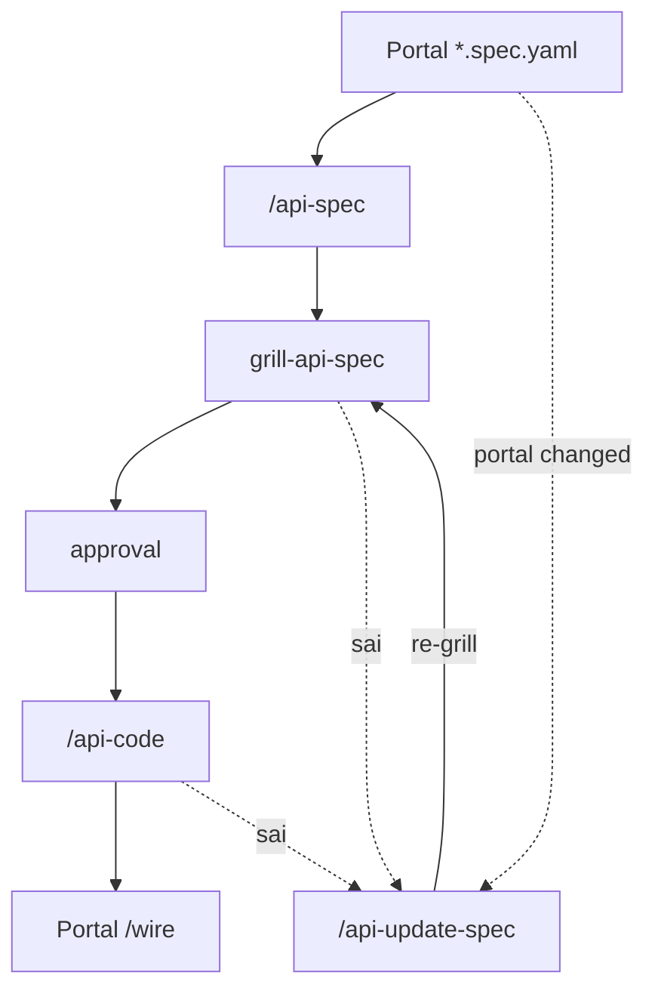

# Backend / API phase

> Chi tiết Phase 2 API (portal view) · [FULL-CYCLE-PIPELINE-DIAGRAM](./FULL-CYCLE-PIPELINE-DIAGRAM)  
> Full workflow (API repo): `~/workspace/api/docs/operational/TEAM-AI-BACKEND-WORKFLOW.md`

---

## API cycle



## Command chain

| Mục tiêu | Chuỗi |
|----------|--------|
| Feature mới | `/api-spec` → grill-api-spec → approval → `/api-code` |
| Portal đổi spec | `/api-update-spec` → grill-api-spec → … |
| Gap | grill-* **sai** → `/api-update-spec` → **re-grill** → grill-api-spec |

## Gap loop

| Khi | Hành động |
|-----|-----------|
| `grill-api-spec` hoặc `/api-code` sai | → `/api-update-spec` → re-grill → grill-api-spec |
| Portal delta | `*.spec.yaml` → `/api-update-spec` (không full `/api-spec` lại) |

```bash
pnpm docs:render
# API repo:
pnpm api:gen:dry --spec docs/features/.../01-backend-spec.yaml
```
