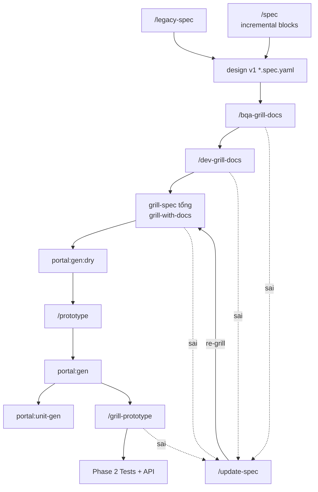

# Design phase — Pipeline cycle

> Chi tiết Phase 1 · [FULL-CYCLE-PIPELINE-DIAGRAM](./FULL-CYCLE-PIPELINE-DIAGRAM)

---

## Design cycle

## Ma trận lệnh

| Lệnh | Vị trí trong flow |
|------|-------------------|
| `/legacy-spec` · `/spec` | → design v1 |
| `/bqa-grill-docs` | sau v1 |
| `/dev-grill-docs` | sau bqa |
| `/grill-with-docs` | = grill-spec tổng |
| `/update-spec` · `/update-spec-legacy` | gap — nhận **sai**, re-grill → grill-spec tổng |
| `/prototype` · `/grill-prototype` | sau dry |
| `portal:unit-gen` | sau `portal:gen` — [PORTAL-CODEGEN](./PORTAL-CODEGEN) |

## Gap loop

| Grill step | Sai → |
|------------|--------|
| `/bqa-grill-docs` | `/update-spec` → re-grill → grill-spec tổng |
| `/dev-grill-docs` | (không quay lại bqa/dev riêng) |
| `grill-spec tổng` | |
| `/grill-prototype` | |

`/spec` incremental: `.cursor/extracts/spec-incremental-blocks.md`  
Common: `common-delete-flow.md` · `common-breadcrumb-flow.md` · `grill-tech-debt.md`
