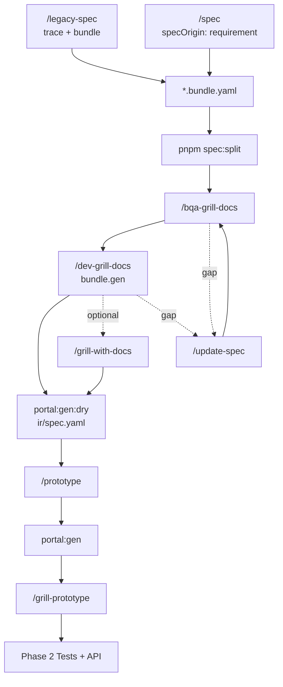

# Design phase — Pipeline cycle

> Chi tiết Phase 1 · Hub: [FEATURE-ARTIFACT-FLOWS](./FEATURE-ARTIFACT-FLOWS.md) · [FULL-CYCLE-PIPELINE-DIAGRAM](./FULL-CYCLE-PIPELINE-DIAGRAM.md)

Diagram tách nhỏ: [FEATURE-ARTIFACT-GRILL](./FEATURE-ARTIFACT-GRILL.md) · [FEATURE-ARTIFACT-BUNDLE-IR](./FEATURE-ARTIFACT-BUNDLE-IR.md)

---

## Design cycle

## Ma trận lệnh

| Lệnh | Artifact |
|------|----------|
| `/legacy-spec` | `_legacy.trace.yaml` + bundle.legacy |
| `/spec` | bundle design v1, `specOrigin: requirement` |
| `/bqa-grill-docs` | design vs legacy ui vs common |
| `/dev-grill-docs` | `bundle.gen` → ir/spec codegen |
| `/grill-with-docs` | Reconcile — **không** default |
| `/prototype` | Chỉ đọc `ir/spec.yaml` |
| `pnpm docs:render` | bundle → `md/` |

## Lệnh script (design phase)

Xem [FEATURE-ARTIFACT-COMMANDS](./FEATURE-ARTIFACT-COMMANDS.md).

## Tag & gap (phase này)

| Doc | Khi nào đọc |
|-----|----------------|
| [TECH-DEBT-FLOW](./TECH-DEBT-FLOW.md) | Grill defer câu hỏi → `#tech-debt:{id}` · step 0 mỗi grill |
| [UPDATE-SPEC-FLOW](./UPDATE-SPEC-FLOW.md) | Gap sau grill/prototype → `#update:*` |
| [FEATURE-ARTIFACT-GRILL](./FEATURE-ARTIFACT-GRILL.md) | Chuỗi bqa → dev → dry |

Sau `portal:gen:dry` pass → [PORTAL-CODEGEN](./PORTAL-CODEGEN.md) · [NEEDS-COMPONENT-FLOW](./NEEDS-COMPONENT-FLOW.md) (`#needs-component` trong `/prototype`).
