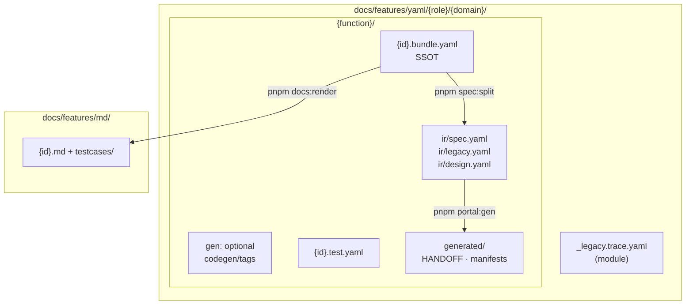

# Artifact layout — yaml / md / generated

> Một diagram · [FEATURE-ARTIFACT-FLOWS](./FEATURE-ARTIFACT-FLOWS.md)

## Quy tắc path

| Path | Vai trò |
|------|---------|
| `docs/features/yaml/{role}/{domain}/{function}/` | Feature specs — `portal:gen` / `docs:render` chỉ quét vùng này |
| `docs/common/yaml/{function}/` | **Shared/common** component specs (dùng lại, ít thay đổi) — tách khỏi features, lệnh riêng |
| `*.bundle.yaml` | SSOT authoring — `spec`, `design`, `legacy`, `review` |
| `bundle.gen` | Dev-grill / portal:gen fields (tách khỏi design v1) |
| `ir/spec.yaml` | **Duy nhất** input `portal:gen` |
| `ir/legacy.yaml` · `ir/design.yaml` | Grill load — không portal:gen |
| `{function}/generated/` | HANDOFF, codegen/unit manifest — **cạnh bundle**, không trong `ir/` |
| `features/md/.../{id}.md` | BA review feature — derived từ bundle |
| `common/md/.../{id}.md` | BA review common — derived từ `common/yaml` |

> **Common tách riêng features:** `portal:gen` / `docs:render` / `spec:split:all` chỉ chạy trong `docs/features/`. Common có lệnh riêng (`*::common`, `phase:common`) vì shared, ít đổi nhưng đổi là ảnh hưởng toàn dự án.

Pattern CRUD: `yaml/_patterns/admin-crud.pattern.yaml`
