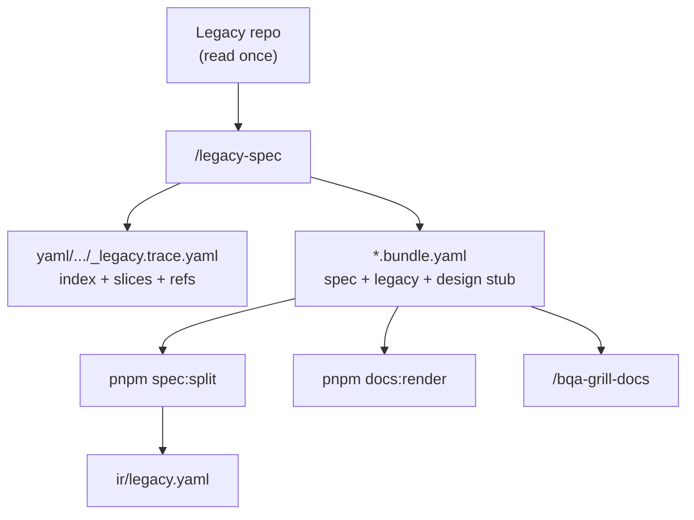

# Legacy trace — archaeology flow

> Một diagram · [FEATURE-ARTIFACT-FLOWS](./FEATURE-ARTIFACT-FLOWS.md)



## Output rules

| Có | Không |
|----|-------|
| `legacy.behaviors[]`, `fields[]`, evidence pointer | `codegen`, `tags`, `ui.filters/columns` |
| `legacyRef` → trace slice | `notes.inferredFromCode` prose dài |
| `{id}.test.yaml` round 1 | portal:gen |

## Validate

```bash
pnpm legacy-trace:validate -- docs/features/yaml/admin/hotel/_legacy.trace.yaml
```

Skill: `.cursor/skills/legacy-spec/SKILL.md` · extract: `legacy-spec`

Handoff mặc định: **`/bqa-grill-docs`** — không nhảy `/grill-with-docs`.
