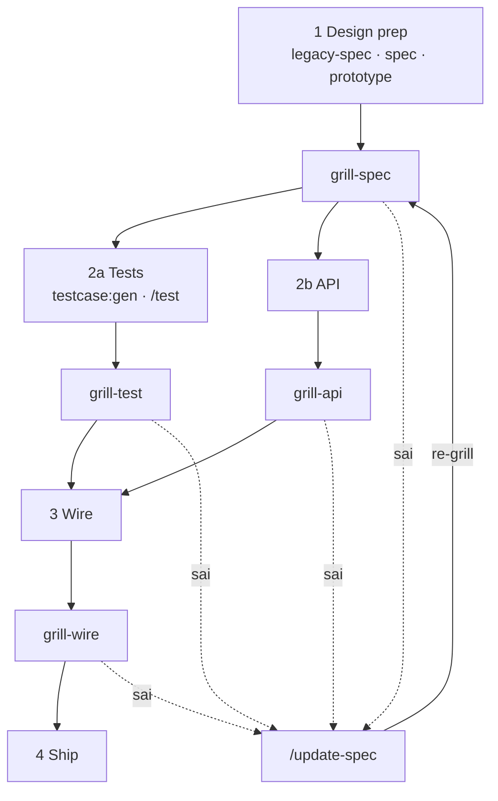

# Full cycle pipeline — Tổng quan

> Một diagram Mermaid ngắn · chi tiết flow → bảng bên dưới.

---

## Toàn flow



## Phase map

| Phase | Đại diện | Detail |
|-------|----------|--------|
| 1 Design | legacy-spec · spec · prototype → grill-spec | [DESIGN-PHASE-DIAGRAM](./DESIGN-PHASE-DIAGRAM) |
| 2a Tests | testcase · `testcase:gen` · grill-test | [TEST-PHASE-DIAGRAM](./TEST-PHASE-DIAGRAM) |
| 2b API | api-spec · grill-api · api-code | [BACKEND-PHASE-DIAGRAM](./BACKEND-PHASE-DIAGRAM) |
| 3 Wire | wire · grill-wire | [WIRE-PHASE-DIAGRAM](./WIRE-PHASE-DIAGRAM) *(TBD)* |
| 4 Ship | review · merge · deploy | — |

## Gap loop

| Khi | Hành động |
|-----|-----------|
| Bất kỳ `grill-*` **sai** | → `/update-spec` (hoặc `/update-spec-legacy`) |
| Sau patch | **re-grill** → `grill-spec` → tiếp tục phase |

[UPDATE-SPEC-FLOW](./UPDATE-SPEC-FLOW) · [TECH-DEBT-FLOW](./TECH-DEBT-FLOW) · [NEEDS-COMPONENT-FLOW](./NEEDS-COMPONENT-FLOW)

```bash
pnpm docs:render && pnpm docs:dev
```
