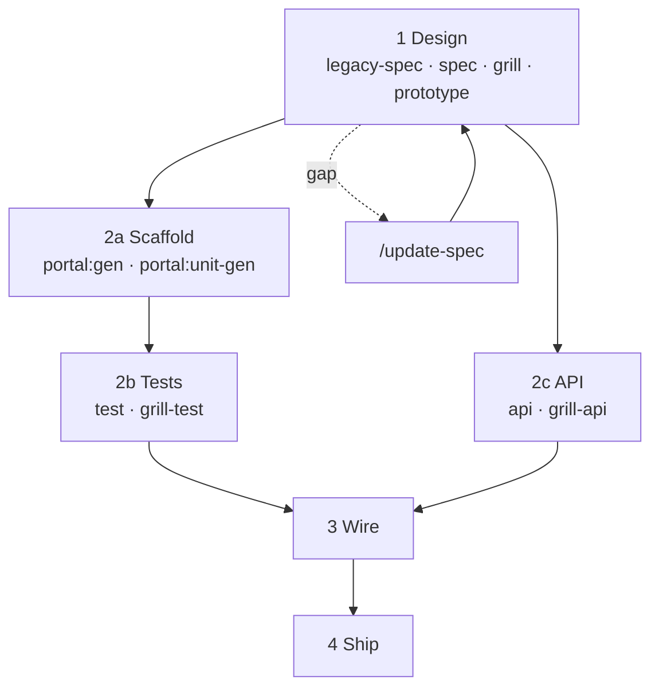

# Full cycle pipeline — Tổng quan

> Một diagram ngắn · **Không** gộp feature artifact — xem [FEATURE-ARTIFACT-FLOWS](./FEATURE-ARTIFACT-FLOWS.md).

---

## Toàn flow (5 phase)



## Phase map

| Phase | Đại diện | Detail |
|-------|----------|--------|
| 1 Design | bundle yaml → ir/spec → prototype | [DESIGN-PHASE-DIAGRAM](./DESIGN-PHASE-DIAGRAM) · [FEATURE-ARTIFACT-FLOWS](./FEATURE-ARTIFACT-FLOWS) |
| 2a Scaffold | `portal:gen` · `portal:unit-gen` · HANDOFF / manifests | [PORTAL-CODEGEN](./PORTAL-CODEGEN) |
| 2b Tests | `*.test.yaml` · `testcase:gen` · grill-test | [TEST-PHASE-DIAGRAM](./TEST-PHASE-DIAGRAM) |
| 2c API | api-spec · grill-api · api-code | [BACKEND-PHASE-DIAGRAM](./BACKEND-PHASE-DIAGRAM) |
| 3 Wire | wire · grill-wire | [WIRE-PHASE-DIAGRAM](./WIRE-PHASE-DIAGRAM) |
| 4 Ship | review · merge · deploy | — |

## Feature artifact (tách file)

| Diagram | File |
|---------|------|
| Layout yaml/md | [FEATURE-ARTIFACT-LAYOUT](./FEATURE-ARTIFACT-LAYOUT) |
| Bundle ↔ IR | [FEATURE-ARTIFACT-BUNDLE-IR](./FEATURE-ARTIFACT-BUNDLE-IR) |
| Legacy trace | [FEATURE-ARTIFACT-LEGACY-TRACE](./FEATURE-ARTIFACT-LEGACY-TRACE) |
| Grill | [FEATURE-ARTIFACT-GRILL](./FEATURE-ARTIFACT-GRILL) |
| Lệnh script | [FEATURE-ARTIFACT-COMMANDS](./FEATURE-ARTIFACT-COMMANDS) |

## Gap loop

[UPDATE-SPEC-FLOW](./UPDATE-SPEC-FLOW) · [TECH-DEBT-FLOW](./TECH-DEBT-FLOW) · [NEEDS-COMPONENT-FLOW](./NEEDS-COMPONENT-FLOW)

## Related docs

| Doc | Nội dung |
|-----|----------|
| [TEST-PHASE-DIAGRAM](./TEST-PHASE-DIAGRAM.md) | E2E lane · testcase:gen · grill-test |
| [UNIT-PHASE-DIAGRAM](./UNIT-PHASE-DIAGRAM.md) | Vitest lane · portal:unit-gen |
| [PORTAL-CODEGEN](./PORTAL-CODEGEN.md) | portal:gen + portal:unit-gen |
| [PORTAL-UNIT-GEN-ROADMAP](./PORTAL-UNIT-GEN-ROADMAP.md) | Roadmap smoke / registry / PRs |
| [DESIGN-PHASE-DIAGRAM](./DESIGN-PHASE-DIAGRAM.md) | Spec → grill → prototype |
| [BACKEND-PHASE-DIAGRAM](./BACKEND-PHASE-DIAGRAM.md) | API repo |
| [WIRE-PHASE-DIAGRAM](./WIRE-PHASE-DIAGRAM.md) | Integration |

```bash
pnpm docs:render && pnpm docs:dev
```
